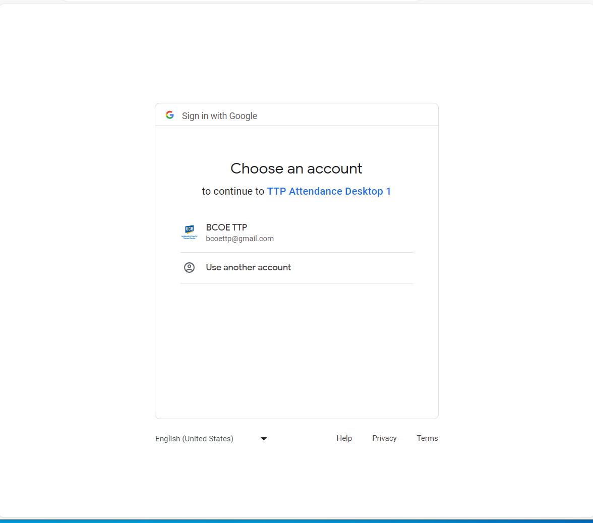
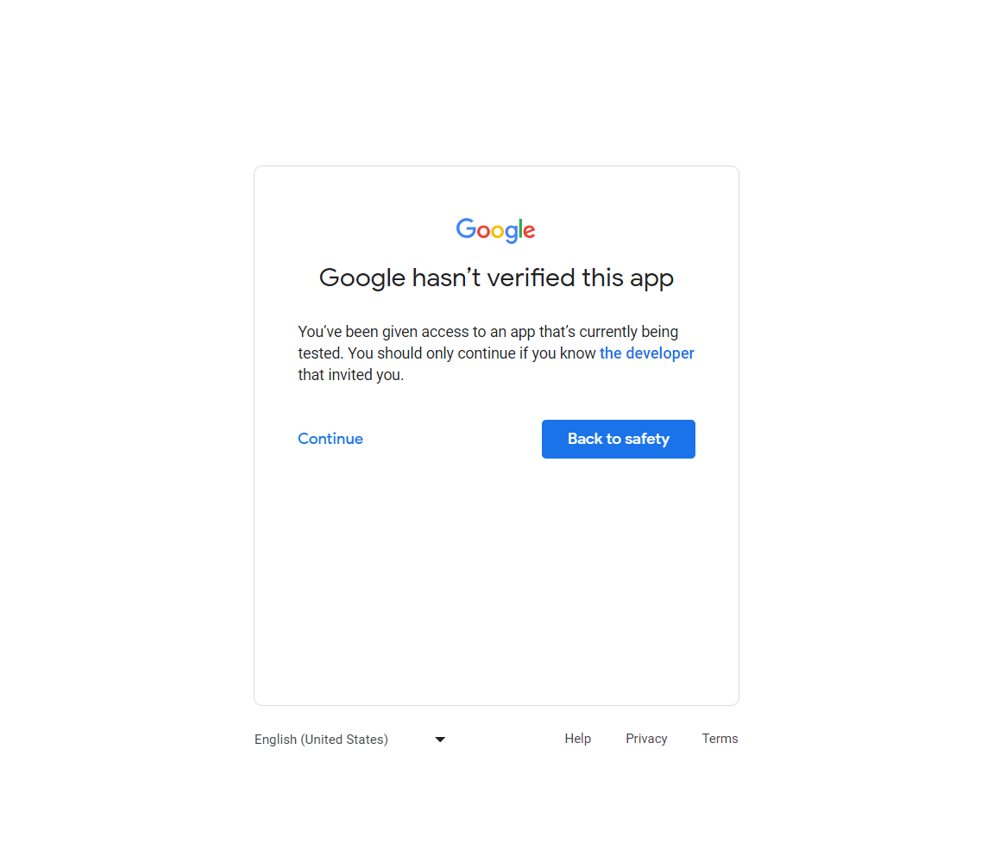
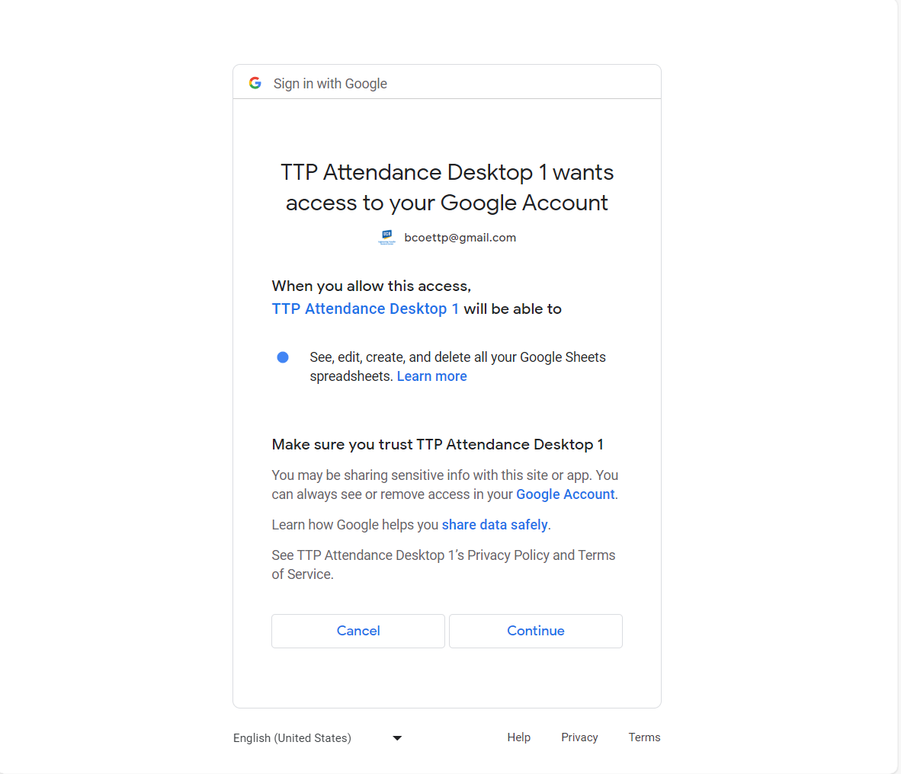
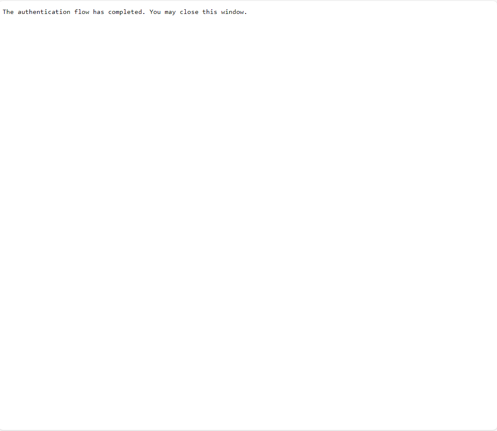
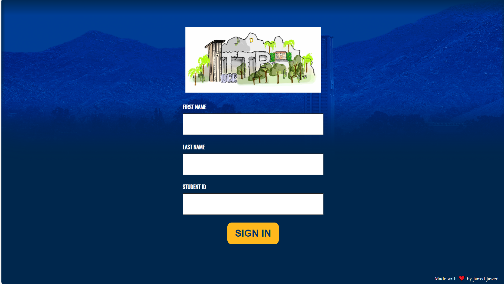

# TTP-Attendance
#### Current Version: 2.0.3

## Description
Desktop application that records student attendance at the TTP Center at UC Riverside (Winston Chung Hall Room 103). Students are able to sign in via a form or by swiping their Student ID card. After each submission, the student's information is then stored into a Google Sheet.

## Setup

The steps within this section should only have to be done if this is the first time this program is being run on a device. Go to the [Usage](#usage) section to learn how to run this program. 

### Install Python 3.7+
Go to <a href="https://www.python.org/downloads/">python.org</a> and install Python version 3.7 or higher.

### Create a Google Cloud Project
If you don't already have a Google Cloud Project, create one <a href="https://console.cloud.google.com/">here</a>. Make sure to **enable the Google Sheets API**. Create an OAuth Client ID with an application type of Desktop application. Download the JSON file provided by Google and rename it to `credentials.json`. Move this file into the root directory of this project.

### Install All Dependencies
Within the root directory of this project, run the following command using your preferred command line program.
```
pip install -r requirements.txt
```

### Save Sheet ID
The unique ID of a Google Sheet has to be saved within the `sheetInfo.json` file so that TTP Attendance is aware of 
the Google sheet it is making edits to. Save the unique ID (this can be found in the URL of the Google Sheet) within `sheetInfo.json` as the value of the `spreadsheetId` attribute.
```
{
  "spreadsheetId": "SPREADSHEET_ID_HERE",
  "scopes": ["https://www.googleapis.com/auth/drive", "https://www.googleapis.com/auth/spreadsheets"]
}

```

## Usage

Within the root directory, run one of the following command using your preferred command line program.
```
python app.py
```

### Authentication

If this is your first time logging in, or if the authorization token provided by Google has expired (which occurrs once every week) the following screen should be shown. Sign in with the appropriate Google account. If this is being used at the Transfer Student Center, the account should be **bcoettp@gmail.com**.



After signing in, the screen below should be shown. Ignore the warning message that the app hasn't been verified by Google. Since it is only being used for the TTP center, there is no need to publish it (hence why it hasn't been verified). Click **Continue**.



The screen below should now be shown. Google simply wants to confirm that you are aware of what the app is doing. It should only require access to Google Sheets. Click **Continue**.



The final screen shown from this process is shown below. You may close this tab and move onto the following step.




### Taking Attendance

If you were able to successfully sign in, the TTP Attendance program should have automatically opened a tab in your default browser with the screen shown below. If one does not exist, open a new tab and go to <a href="http://localhost:5000">localhost:5000</a>. Open it in full screen (F11 on Windows). You should now be able to record attendance.


