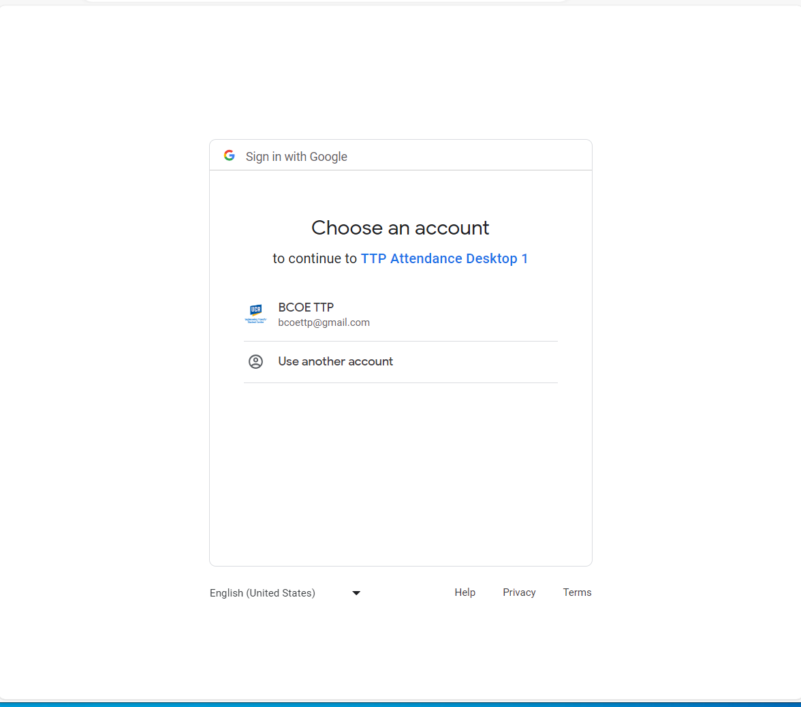
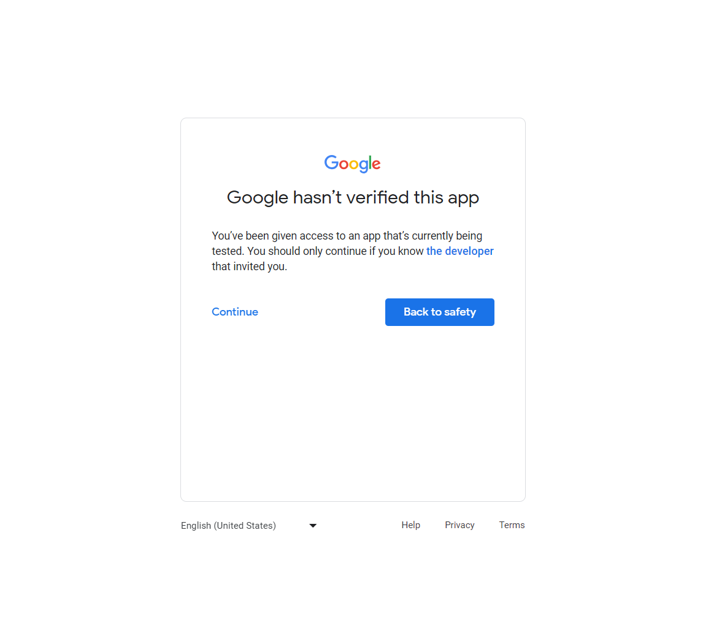
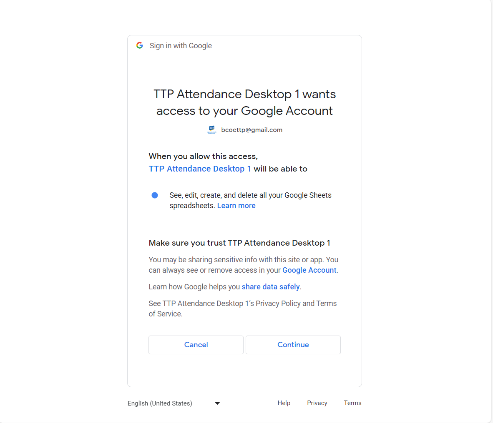
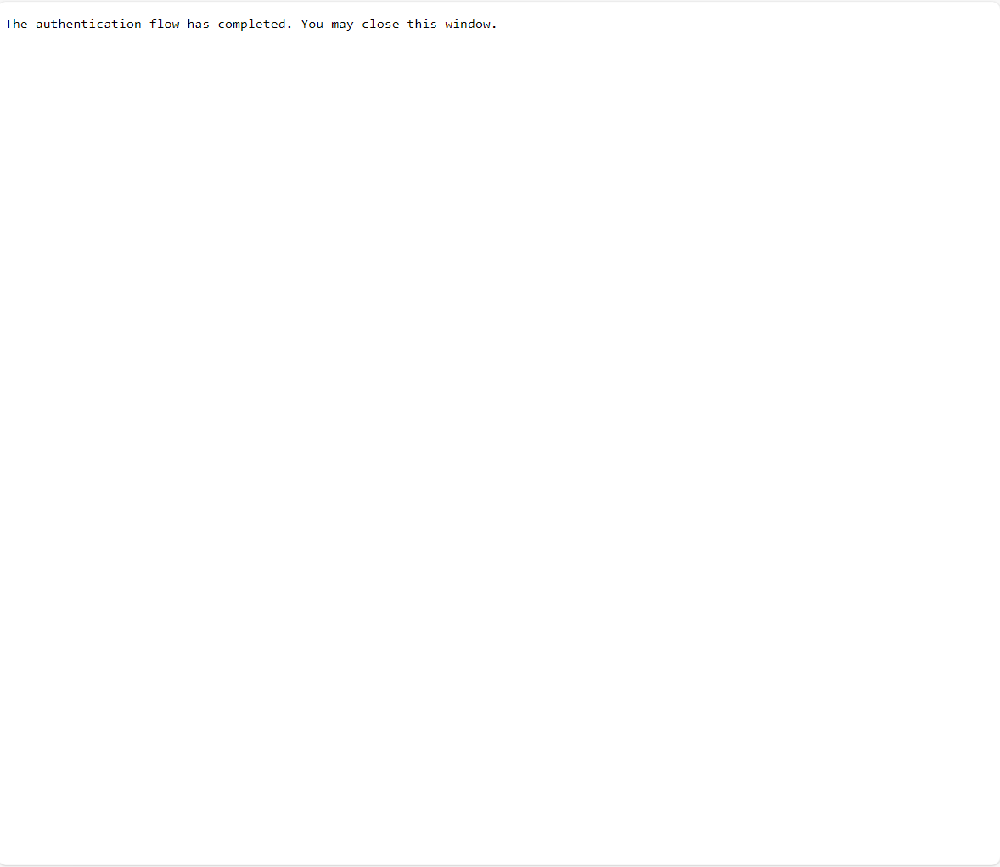
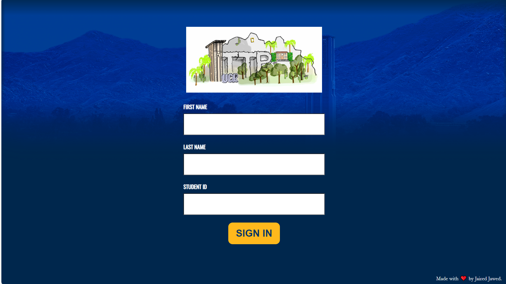

# TTP-Attendance

#### Current Version: 3.0.0

## Description

Desktop application that records student attendance at the TTP Center at UC Riverside (Winston Chung Hall Room 103). Students are able to sign in via a form or by swiping their Student ID card. After each submission, the student's information is then stored into a Google Sheet.

Version 3 is a native desktop app built with [Wails v3](https://v3.wails.io) (Go) and React. Earlier versions ran a local Flask server and opened the sign-in page in a browser tab; there is no longer a server, a browser, or a Python install involved.

## How it works

The app opens full screen on the front desk and shows the sign-in form. A student either fills it in or swipes their student ID card, which a magnetic stripe reader types into a hidden field.

- A student who has signed in before is recorded straight away and gets a welcome screen for three seconds.
- A student the app has not seen before is asked for their major first. They are then added to the `Students` directory sheet so they go straight through next time.
- Each sign-in is appended to a sheet named for the current month (`Jan 2026`). That sheet is created, with headers, on the month's first sign-in.

After fifteen seconds of inactivity the form clears itself and returns focus to the card reader, so a half-finished entry never blocks the next student's swipe.

## Setup

The steps in this section only need doing the first time the app is run on a device.

### Create a Google Cloud Project

If you don't already have a Google Cloud Project, create one [here](https://console.cloud.google.com/). Make sure to **enable the Google Sheets API**. Create an OAuth Client ID with an application type of **Desktop app** and download the JSON file Google provides.

### Connect the app

Launch TTP Attendance. The first time it runs it opens on the Settings screen, which walks through three steps:

1. **Google API credentials** — choose the JSON file you just downloaded.
2. **Attendance spreadsheet** — paste the spreadsheet's id, or just paste its full URL and the id will be pulled out of it.
3. **Google account** — sign in as the account that owns the spreadsheet. If this is being used at the Transfer Student Center, the account should be **bcoettp@gmail.com**.

Step 3 opens your browser. Sign in with the appropriate Google account:



Ignore the warning that the app hasn't been verified by Google. Since it is only used for the TTP center there is no need to publish it, which is why it isn't verified. Click **Continue**.



Google confirms what the app is asking for. It should only require access to Google Sheets. Click **Continue**.



The final screen confirms you're signed in. You can close that tab and return to the app.



Once all three steps show a check mark, press **Start taking attendance**. The sign-in screen is now ready:



Settings can be reopened at any time from the gear button in the bottom-left corner.

### Where settings are stored

Credentials, the saved Google authorisation and the spreadsheet id are stored per user, outside the app itself:

| Platform | Location |
| --- | --- |
| macOS | `~/Library/Application Support/TTP Attendance/` |
| Linux | `~/.config/TTP Attendance/` |
| Windows | `%AppData%\TTP Attendance\` |

**Show config folder** on the Settings screen opens it. The app also reads `credentials.json`, `token.json` and `sheetInfo.json` from its working directory if the config directory doesn't have them, which lets an existing version 2 checkout keep its spreadsheet id.

The Google authorisation refreshes itself, so unlike version 2 there is no need to sign in again every week. If it is ever revoked, the app says so and points at Settings.

## The spreadsheet

The app expects one spreadsheet containing a sheet named `Students`, used as the directory of everyone who has signed in before:

| First Name | Last Name | Student ID | Major |
| --- | --- | --- | --- |

Month sheets are created automatically alongside it:

| First Name | Last Name | Student ID | Sign In Date | Sign In Time |
| --- | --- | --- | --- | --- |

## Development

### Requirements

- Go 1.25+ — the repo pins Go via [mise](https://mise.jdx.dev) (`mise install`), but any install works.
- Node 20+
- The Wails v3 CLI: `go install github.com/wailsapp/wails/v3/cmd/wails3@latest`

Run `wails3 doctor` to check for missing platform dependencies.

### Commands

Run these from the root of the project.

```sh
wails3 dev              # run with hot reload
wails3 task build       # build the binary into bin/
wails3 task package     # build a distributable app bundle
go test ./...           # run the Go tests
```

`main.go` embeds `frontend/dist`, which isn't checked in, so on a fresh clone run `wails3 task build` once before `go vet` or `go test` — otherwise the embed has nothing to match and the package won't compile.

`wails3 task build` regenerates the TypeScript bindings in `frontend/bindings` from the Go service methods, so a change to a service signature shows up as a type error in the frontend rather than a runtime failure.

### Layout

```
main.go                    application and window setup
attendanceservice.go       sign-in service called from the frontend
settingsservice.go         setup service called from the frontend
internal/config/           where credentials, tokens and the sheet id live
internal/sheets/           Google Sheets client and OAuth flow
frontend/src/views/        the four screens
frontend/bindings/         generated — do not edit by hand
```

## License

See [LICENSE](./LICENSE).
